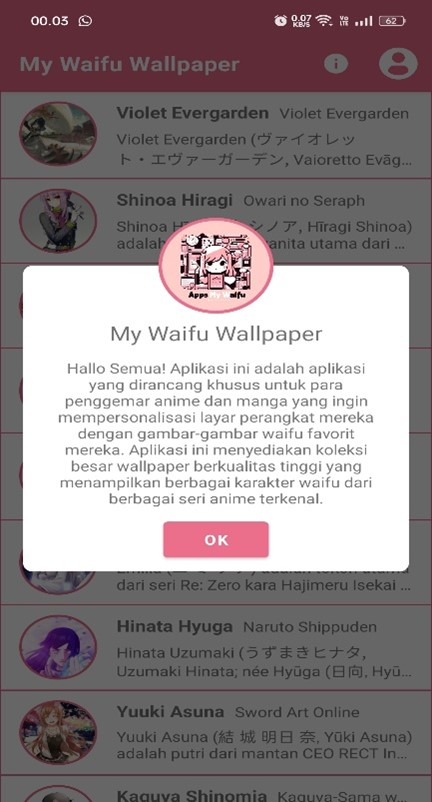
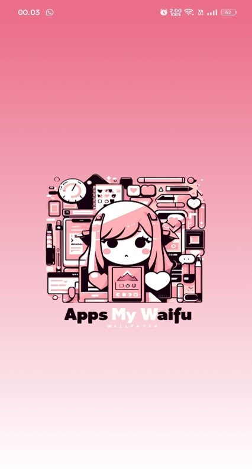
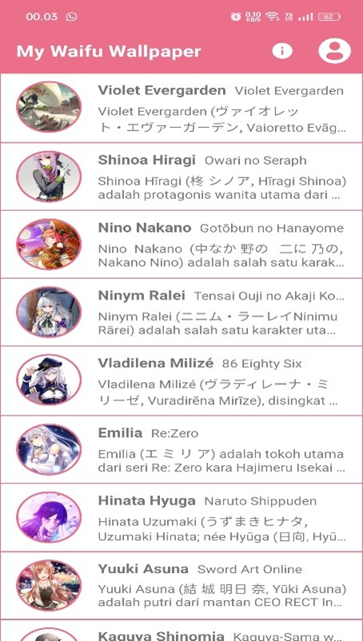

# MyWaifuApps

**MyWaifuApps** adalah aplikasi mobile berbasis Android yang menampilkan daftar karakter anime (waifu) favorit. Aplikasi ini dibangun menggunakan bahasa pemrograman Java dan memanfaatkan `RecyclerView` untuk menampilkan daftar gambar karakter pada halaman utama, serta halaman detail untuk informasi lengkap setiap karakter. Selain itu, terdapat halaman About yang menampilkan profil developer.
Aplikasi ini juga menyediakan fitur untuk mengatur gambar waifu sebagai wallpaper HP langsung dari aplikasi.

## Fitur Utama

- **Halaman Utama**: Menampilkan daftar karakter anime dengan gambar dan nama menggunakan RecyclerView.
- **Halaman Detail**: Menyediakan informasi lebih lanjut tentang karakter, termasuk deskripsi dan gambar beresolusi tinggi.
- **Halaman About**: Menampilkan profil developer aplikasi.
- **Atur Wallpaper**: Setiap gambar waifu dapat dijadikan wallpaper HP dengan satu klik dari halaman detail.

## Screenshots

                                                                                    | Info                          |
                                                                                    | ----------------------------- |
                                                                                    |  |

| SplashScreen                                    | Halaman Utama                                   | Halaman Detail                                    | Halaman Profil                                   |
| ----------------------------------------------- | ----------------------------------------------- | ------------------------------------------------- | ------------------------------------------------ |
|  |  |  |  |

## Teknologi yang Digunakan

- **Bahasa Pemrograman**: Java
- **Komponen UI**:
  - RecyclerView untuk daftar karakter
  - Intent untuk navigasi antar halaman
- **Desain Layout**: XML
- **Tool Pengembangan**: Android Studio

## Cara Menjalankan Aplikasi

1. **Clone Repository**  
   Clone repository ini ke komputer lokal Anda dengan perintah berikut:

   ```bash
   git clone https://github.com/Ysfii-Dev/MyWaifuApps.git
   ```

2. **Buka di Android Studio**  
   Buka folder proyek di Android Studio.

3. **Install Dependensi**  
   Pastikan Anda telah mengunduh semua dependensi yang diperlukan dengan menjalankan `Gradle Sync`.

4. **Jalankan Aplikasi**  
   Hubungkan perangkat Android atau emulator, lalu klik tombol **Run** di Android Studio.

## Kontribusi

Kontribusi sangat diterima! Silakan fork repository ini, buat branch baru untuk fitur Anda, dan ajukan pull request.

## Kontak Developer

Jika Anda memiliki pertanyaan atau saran, silakan hubungi:

- **Nama**: Yusfi Syawali
- **Email**: yusfisyawali@gmail.com

## Lisensi
